# Database Schema Documentation

This document provides Entity-Relationship Diagrams (ERD) and table descriptions for the Nexus Dominion database schema.

**Schema Source:** `src/lib/db/schema.ts`
**Database:** PostgreSQL (Neon)
**ORM:** Drizzle

---

## Schema Overview

The database is organized into 11 domains:

| Domain | Tables | Purpose |
|--------|--------|---------|
| Core Game | 5 | Game lifecycle, saves, configuration |
| Empires | 2 | Player/bot empires and territories |
| Military & Combat | 4 | Units, attacks, battle logs |
| Economy | 2 | Market prices and trade orders |
| Research | 2 | Tech progression and branch allocation |
| Diplomacy | 3 | Treaties, reputation, messages |
| Bot AI | 3 | Bot memories, emotions, tells |
| Events | 3 | Galactic events and coalitions |
| LLM Integration | 2 | LLM usage tracking and caching |
| Geography | 3 | Galaxy regions, connections, influence |
| Crafting & Syndicate | 5 | Advanced resource crafting, contracts |

**Total Tables:** 34

---

## Core Game Domain

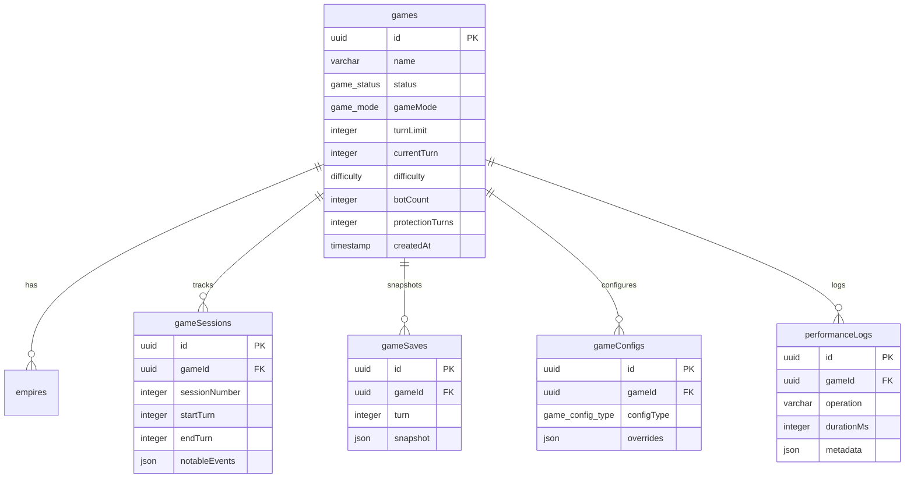

### Table: `games`

Central game state table.

| Column | Type | Description |
|--------|------|-------------|
| `id` | uuid | Primary key |
| `name` | varchar(255) | Game name |
| `status` | enum | setup, active, paused, completed, abandoned |
| `gameMode` | enum | oneshot (quick) or campaign (multi-session) |
| `turnLimit` | integer | Maximum turns (50-500) |
| `currentTurn` | integer | Current game turn |
| `difficulty` | enum | easy, normal, hard, nightmare |
| `botCount` | integer | Number of AI opponents (10-100) |
| `protectionTurns` | integer | Grace period before attacks allowed |

---

## Empires Domain

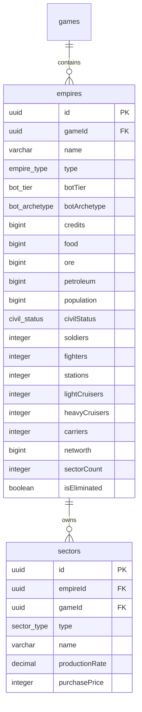

### Table: `empires`

Player and bot empire data.

| Column | Type | Description |
|--------|------|-------------|
| `id` | uuid | Primary key |
| `gameId` | uuid | Foreign key to games |
| `name` | varchar(255) | Empire name |
| `type` | enum | player or bot |
| `botTier` | enum | tier1_llm, tier1_elite_scripted, tier2_strategic, tier3_simple, tier4_random |
| `botArchetype` | enum | warlord, diplomat, merchant, schemer, turtle, blitzkrieg, tech_rush, opportunist |
| `credits/food/ore/petroleum` | bigint | Base resources |
| `population` | bigint | Current population |
| `civilStatus` | enum | ecstatic → content → neutral → unhappy → revolting |
| `soldiers/fighters/etc` | integer | Military unit counts |
| `networth` | bigint | Calculated empire value |
| `isEliminated` | boolean | Whether empire is defeated |

### Table: `sectors`

Territory owned by empires.

| Column | Type | Description |
|--------|------|-------------|
| `type` | enum | food, ore, petroleum, tourism, urban, education, government, research, supply, anti_pollution, industrial |
| `productionRate` | decimal | Resource output per turn |
| `purchasePrice` | integer | Cost to acquire |

---

## Military & Combat Domain

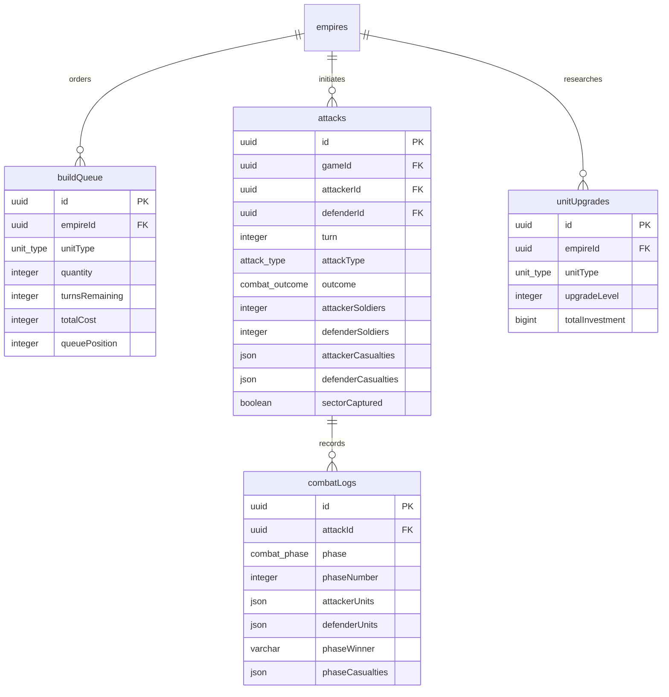

### Table: `attacks`

Combat encounter records.

| Column | Type | Description |
|--------|------|-------------|
| `attackerId` | uuid | Attacking empire |
| `defenderId` | uuid | Defending empire |
| `attackType` | enum | invasion or guerilla |
| `outcome` | enum | attacker_victory, defender_victory, retreat, stalemate |
| `attackerCasualties` | json | `{ soldiers: N, fighters: N, ... }` |
| `sectorCaptured` | boolean | Whether territory changed hands |

---

## Economy Domain

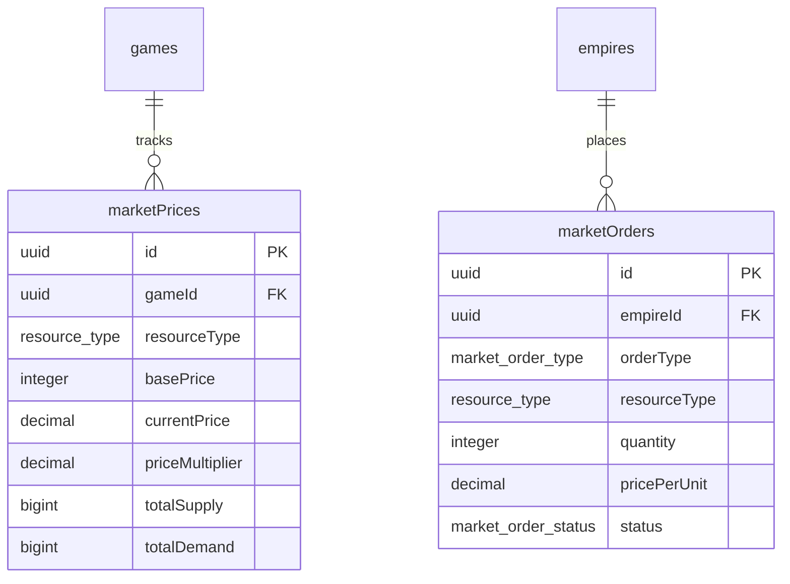

### Market Price Range

Per PRD 4, prices fluctuate between 0.4x and 1.6x base price based on supply/demand.

---

## Research Domain

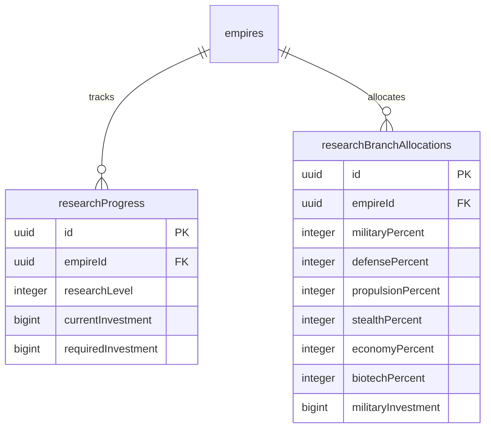

### Research Branches

Six branches with percentage allocation (must sum to 100):
- Military, Defense, Propulsion, Stealth, Economy, Biotech

---

## Diplomacy Domain

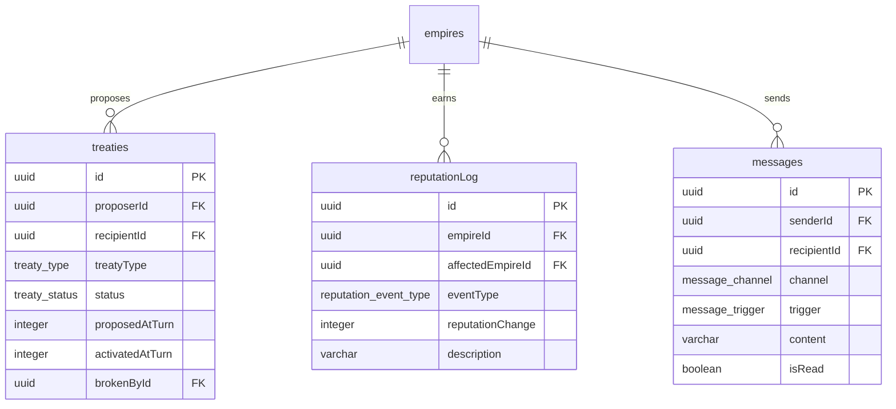

### Treaty Types

- **NAP (Non-Aggression Pact):** No attacks for duration
- **Alliance:** Shared defense, trade bonuses

### Message Triggers

greeting, battle_taunt, victory_gloat, defeat, trade_offer, alliance_proposal, betrayal, covert_detected, tribute_demand, threat_warning, retreat, eliminated, endgame, broadcast_shout, casual_message

---

## Bot AI Domain

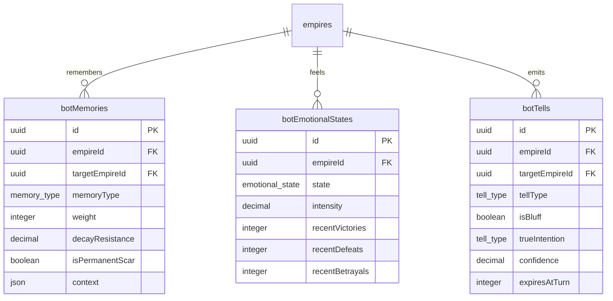

### Emotional States

confident, arrogant, desperate, vengeful, fearful, triumphant, neutral

### Bot Tell Types

military_buildup, fleet_movement, target_fixation, diplomatic_overture, economic_preparation, silence, aggression_spike, treaty_interest

---

## Events Domain

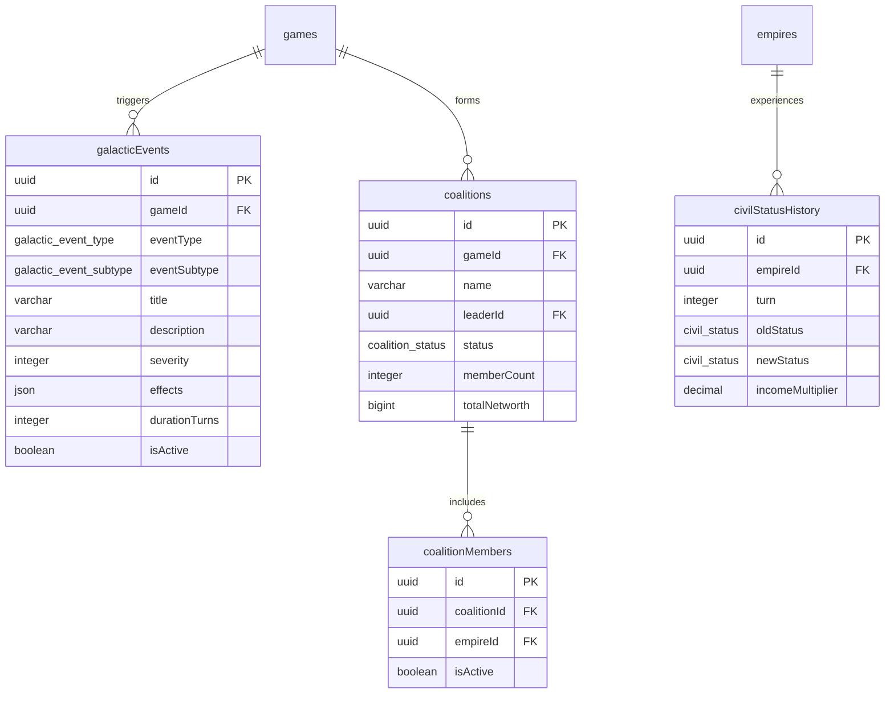

### Galactic Event Types

- **Economic:** market_crash, resource_boom, trade_embargo, economic_miracle
- **Political:** coup_attempt, assassination, rebellion, political_scandal
- **Military:** pirate_armada, arms_race, mercenary_influx, military_parade
- **Narrative:** ancient_discovery, prophecy_revealed, mysterious_signal, cultural_renaissance

---

## LLM Integration Domain

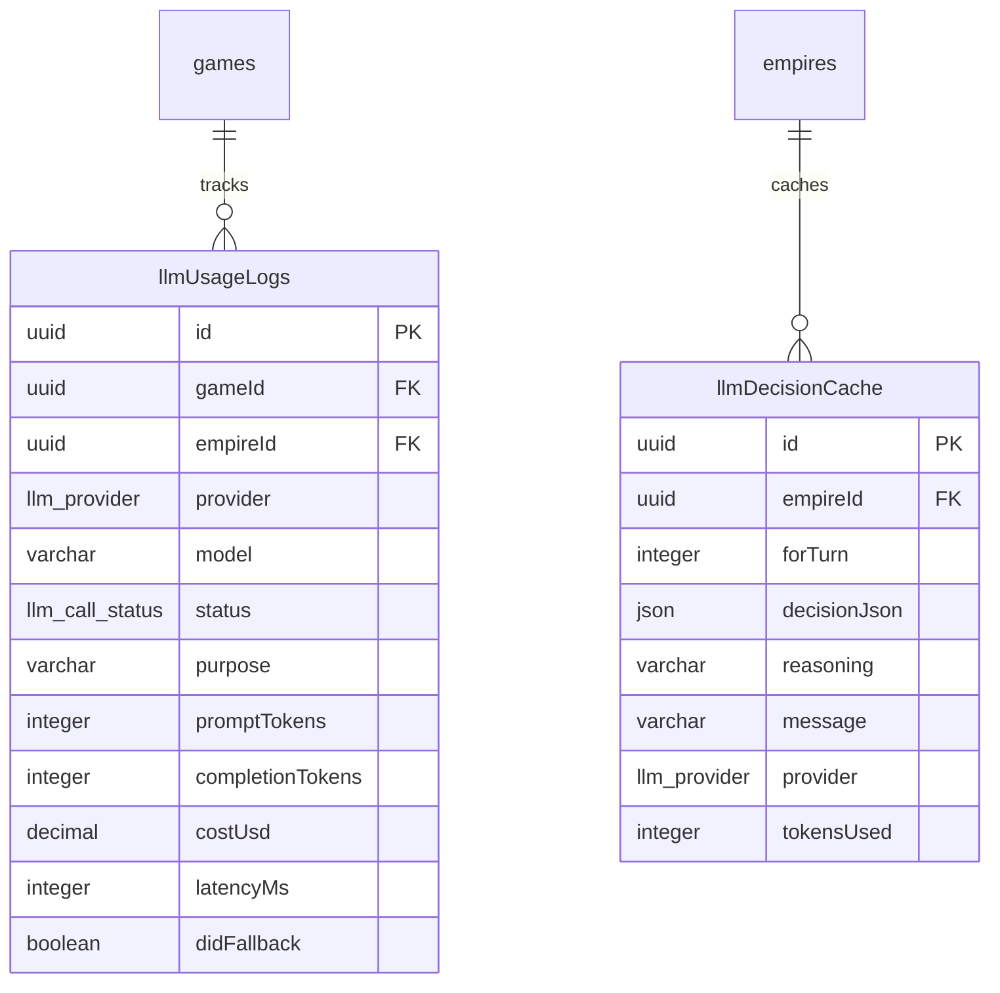

### LLM Providers

groq, together, openai, anthropic

---

## Geography Domain

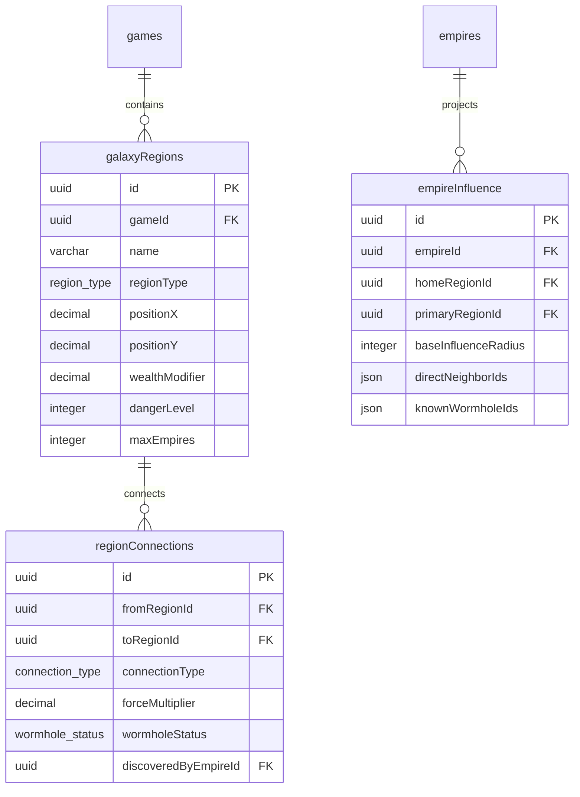

### Region Types

core (1.5x wealth), inner (1.2x), outer (1.0x), rim (0.5x), void (0.3x, dangerous)

### Connection Types

adjacent (1.0x), trade_route (1.0x + bonus), wormhole (shortcut), hazardous (1.5x), contested (1.25x + events)

---

## Crafting & Syndicate Domain

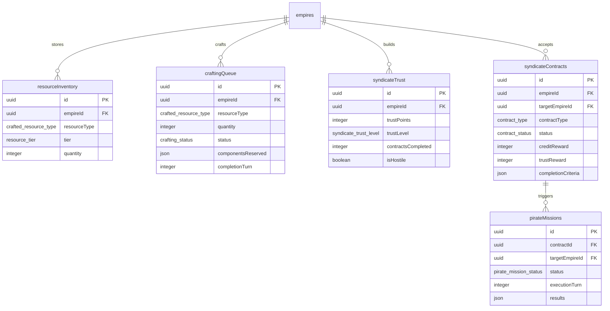

### Resource Tiers

- **Tier 0:** credits, food, ore, petroleum (base)
- **Tier 1:** refined_metals, fuel_cells, polymers (refined)
- **Tier 2:** electronics, armor_plating, propulsion_units (manufactured)
- **Tier 3:** reactor_cores, shield_generators, nuclear_warheads (advanced)

### Syndicate Trust Levels

unknown → associate → runner → soldier → captain → lieutenant → underboss → consigliere → syndicate_lord

---

## Enum Reference

### Game Enums

| Enum | Values |
|------|--------|
| `game_status` | setup, active, paused, completed, abandoned |
| `game_mode` | oneshot, campaign |
| `difficulty` | easy, normal, hard, nightmare |
| `victory_type` | conquest, economic, diplomatic, research, military, survival |

### Empire Enums

| Enum | Values |
|------|--------|
| `empire_type` | player, bot |
| `bot_tier` | tier1_llm, tier1_elite_scripted, tier2_strategic, tier3_simple, tier4_random |
| `bot_archetype` | warlord, diplomat, merchant, schemer, turtle, blitzkrieg, tech_rush, opportunist |
| `civil_status` | ecstatic, happy, content, neutral, unhappy, angry, rioting, revolting |

### Combat Enums

| Enum | Values |
|------|--------|
| `unit_type` | soldiers, fighters, light_cruisers, heavy_cruisers, carriers, stations, covert_agents |
| `attack_type` | invasion, guerilla |
| `combat_outcome` | attacker_victory, defender_victory, retreat, stalemate |
| `combat_phase` | space, orbital, ground |

### Sector Enums

| Enum | Values |
|------|--------|
| `sector_type` | food, ore, petroleum, tourism, urban, education, government, research, supply, anti_pollution, industrial |

---

## Indexes

All tables include strategic indexes for common query patterns:

- **Game-scoped queries:** `*_game_idx` on all child tables
- **Empire-scoped queries:** `*_empire_idx` on owned resources
- **Turn-based queries:** `*_turn_idx` for historical lookups
- **Status filters:** `*_status_idx` for active/pending items
- **Type filters:** `*_type_idx` for category filtering

---

## Migration Notes

- All tables use UUID primary keys with `defaultRandom()`
- Foreign keys use `CASCADE` delete for child records
- Timestamps use `defaultNow()` for creation tracking
- JSON columns use `json()` for flexible nested data
- Decimal precision varies by use case (prices: 12,2; percentages: 5,2)

---

*Generated: 2026-01-08*
*Schema version: Aligned with src/lib/db/schema.ts*
